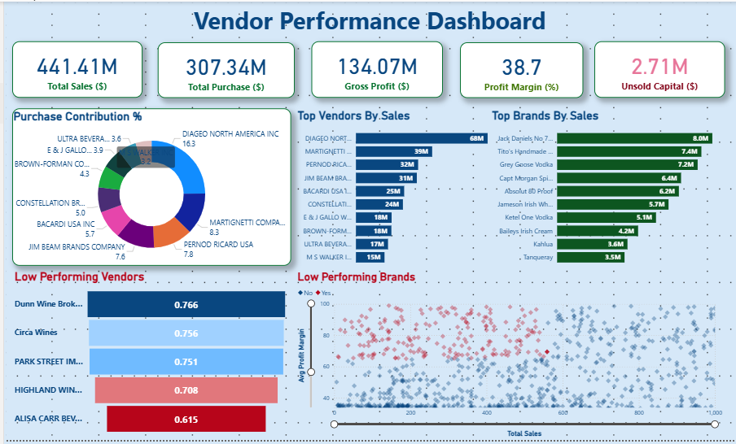

# 📈 Vendor Performance Analysis – Data Analyst Project

This project presents an in-depth analysis of vendor performance using Python, Jupyter Notebooks, and Power BI. It involves data ingestion, exploratory data analysis, and interactive reporting.

## 🗂 Project Structure

- **Vendor Performance Analysis.ipynb** – Key analysis and insights.
- **Exploratory Data Analysis.ipynb** – Initial data exploration.
- **get_vendor_summary.py** – Script for summarizing vendor data.
- **ingestion_db.py** – Sample script to simulate database ingestion.
- **vendor_sales_summary.csv** – Dataset used in the analysis.
- **Vendor Performance Report.pdf** – PDF report with visual insights.
- **vendor_performance.pbix** – Power BI file for dynamic dashboards.

## 🛠 Tools & Technologies

- **Python** – pandas, matplotlib, seaborn
- **Jupyter Notebook**
- **Power BI**
- **Git & GitHub**

Power BI Dashboard



## 🚀 Getting Started

Clone this repository and open the notebooks using Jupyter or any compatible IDE like VS Code.

```bash
git clone https://github.com/your-username/data-analyst-project.git
cd data-analyst-project
jupyter notebook
```

## 📊 Summary

This project provides insights into vendor efficiency, sales trends, and performance comparisons to assist in decision-making processes.

---

🎯 **Ideal For:** Showcasing Data Analytics skills in Python, report building, and dashboard creation.
